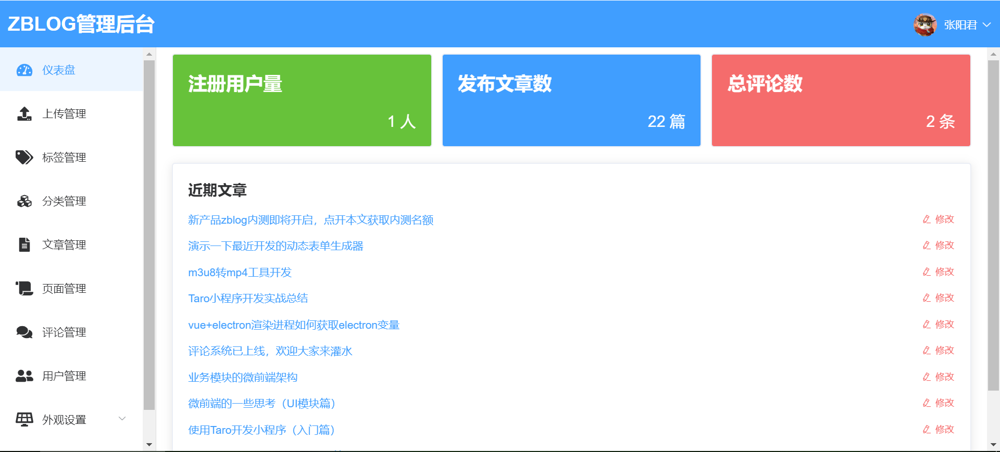
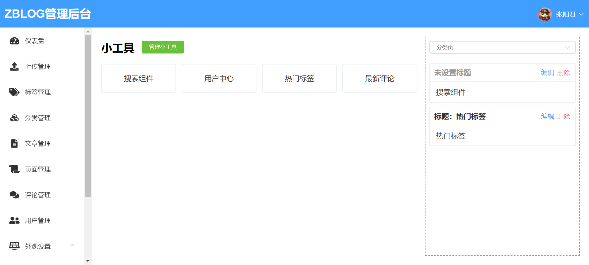
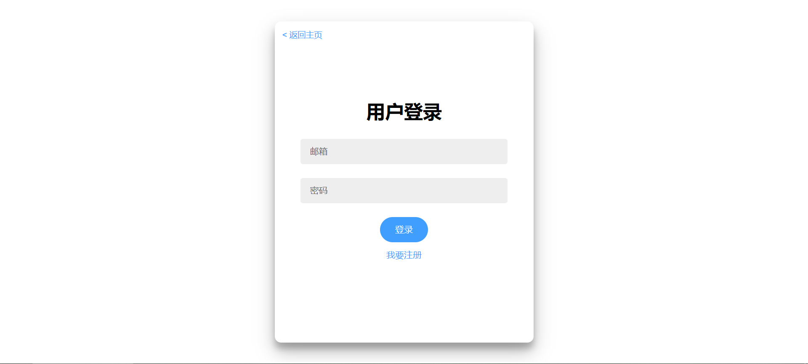

# zblog安装程序 (努力开发中...)

## 这个项目是做什么的

这个项目是zblog的安装程序，只要你有备案好的域名和linux服务器，使用内测码可以一键安装zblog（内测码获取方式查看文末）。

## zblog博客系统介绍

zblog是一套基于node.js，nunjucks和vue开发的博客系统，参考了早年使用的wordpress的很多功能，灵感来源于firekylin，主题样式则借鉴了大前端。下面展示几个截图大家随意感受一下：

管理员登录页：

仪表盘页面：

侧边栏管理页：

评论管理页：

插入资源页:

网站主页:

网站文章页:

文章评论区:

用户登录页:

用户评论管理页:

zblog优势：

1. zblog底层采用<code>node.js</code>开发，性能优秀
2. zblog整合了七牛云，上传一键即达，同时也可以切换本地存储，灵活方便
3. zblog自带主题符合国人审美，基于gitalk样式的评论组件美观大方
4. zblog很多细节都可以自由替换，即使你不懂代码，也能轻松管理界面
5. zblog使用markdown作为主要的富文本编辑器，撰文轻松，排版简洁明了
6. zblog整合了微信网页sdk，几行配置轻松接入微信
7. 更多功能，就等你来...

由于zblog刚刚起步，还有很多需要完善的地方，因此我启动了本次内测工作。如果大家对zblog感兴趣，并且想要获得首批内测资格，欢迎扫码添加微信申请（二维码见下图），第一批内测计划500人，人满后再逐一发放内测码（欢迎大家奔走相告）。

更多细节详见：https://www.zhangyangjun.com/post/zblog-alpha-test.html