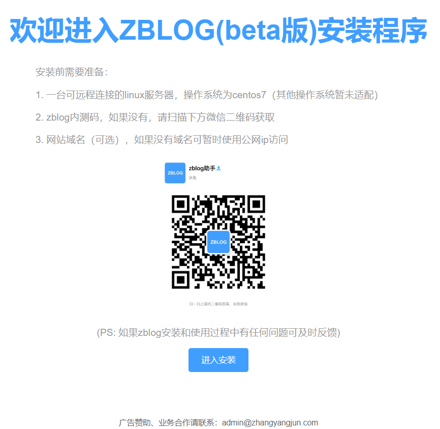
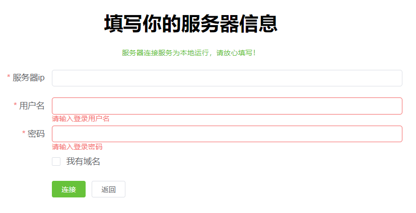
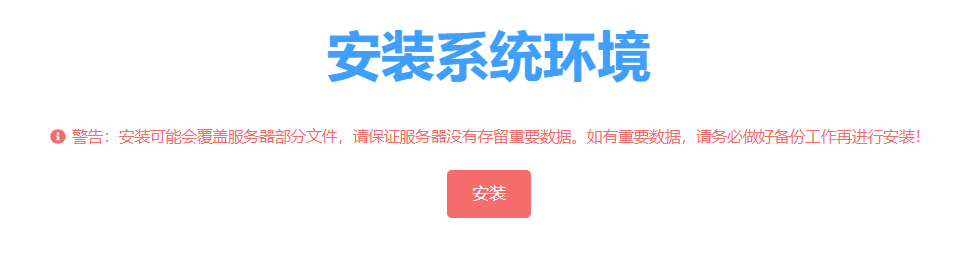
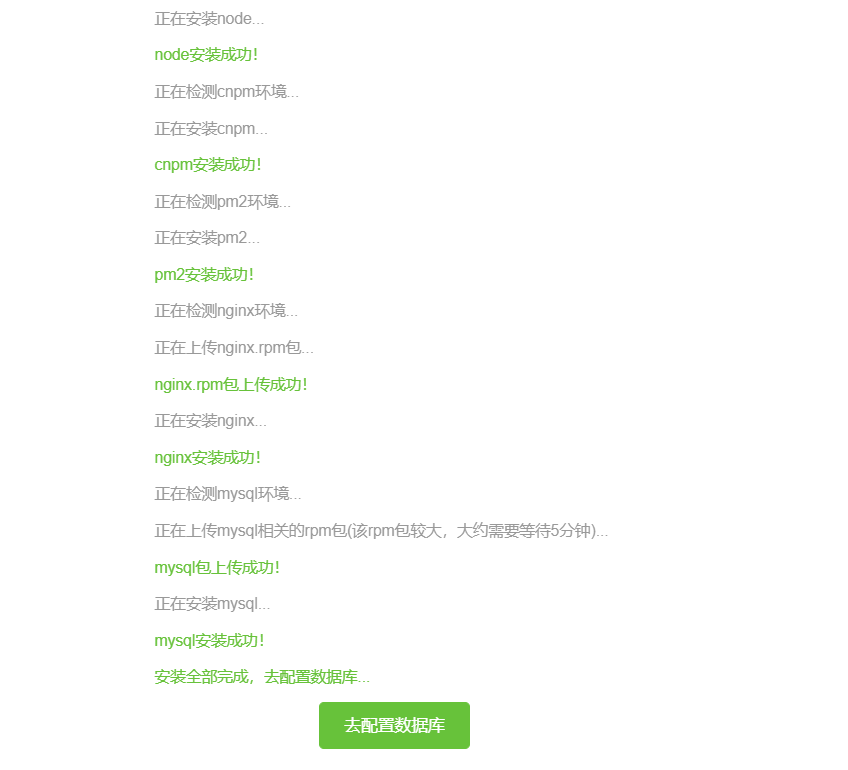
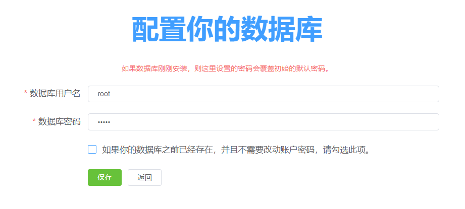
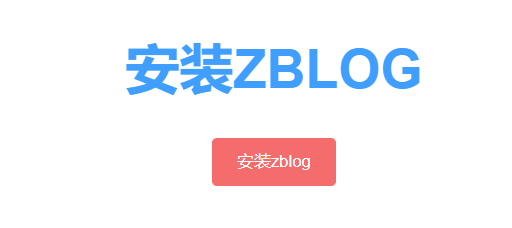
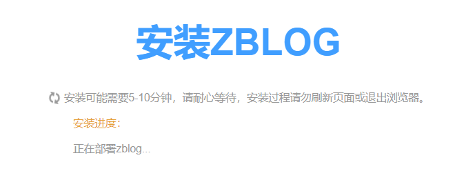
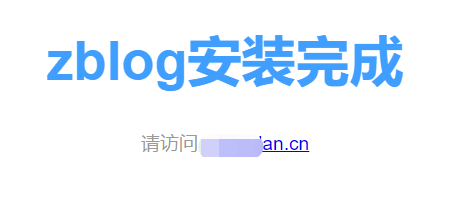
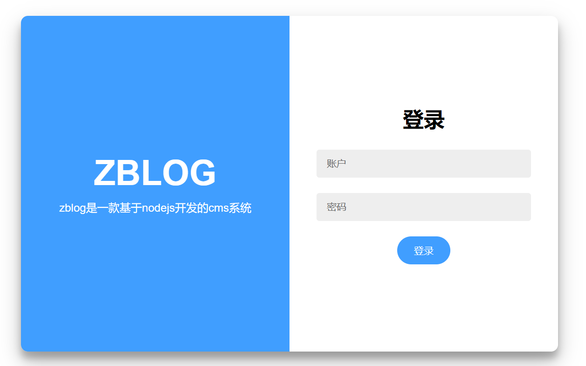
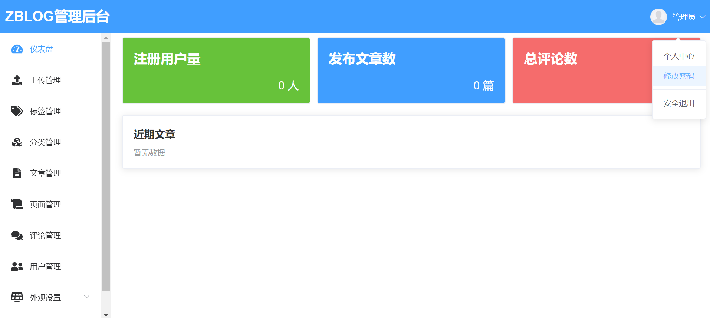

# zblog安装程序（目前仅支持，linux的centos7系统）

## 这个项目是做什么的

这个项目是zblog的安装程序，只要你有一台linux-centos7服务器，目前使用内测码可以一键安装zblog。

## zblog博客系统介绍

详见：https://www.zhangyangjun.com/post/zblog-alpha-test.html

## zblog助手

使用过程中有任何疑问，可以添加zblog助手咨询！

## 使用说明

1. 进入zblog_installer的release页面：https://github.com/supervergil/zblog_installer/releases/download/1.0.2/zblog_installer.zip ，下载最新的release包

2. 解压release包，进入文件夹后，执行<code>npm install</code>安装依赖

3. 执行<code>npm run download</code>下载安装环境所需的rpm包（共需下载mysql-client.rpm和mysql-server.rpm两个包，如果rpm下载失败，可以根据命令行提示，手动下载rpm包），下载完成后执行<code>npm start</code>

4. 打开http://localhost:3000 ，可以看到安装界面

    

5. 填写服务器相关信息，有域名则勾选复选框填入域名信息

    

6. 连接成功后，进入系统环境安装

    

7. 启动安装后，会有安装进度提示，耐心等待12-20分钟，可以看到配置数据库的按钮出现

    

8. 配置你的数据库账户和密码，初次安装数据库，密码是默认进行覆盖的，如果你的数据库之前已经存在，则勾选复选框，并填入旧密码即可进入下一步

    

9. 接下来可以安装zblog了，点击安装进行

    

    

10. 安装完成后，会提示点击链接

    

11. 输入你服务器公网ip或者域名，即可访问刚刚安装好的博客

12. 使用ip/admin或者域名/admin可以进入博客后台，初始账户为**admin**，初始密码为**admin123456**

    

13. 接下来进入后台好好配置你的博客程序吧，请记得点击右上角的头像，先把密码给修改了！

    

## 其他

广告赞助或者业务合作，可以联系admin@zhangyangjun.com，谢谢你的支持！